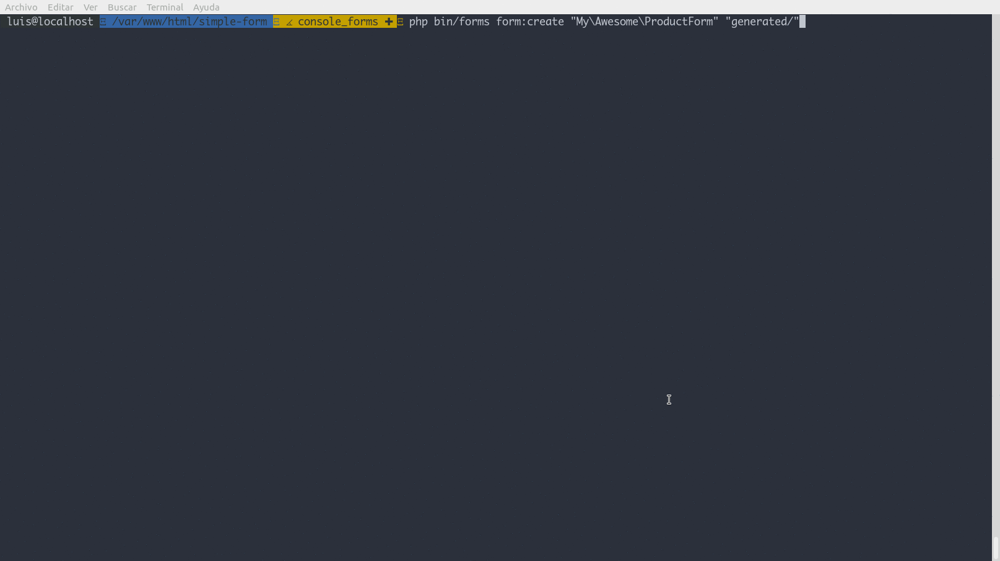

# Generating code

Creating forms can be a repetitive task that can be automated. You can generate
the code for your forms using the script in `bin/forms` and installing the
[Symfony2 Console][9] component.

The following example shows how to create a form to add a product to a catalog.
The form will include a name, an optional description, the various categories to
which the element can be classified and an indicator to know when a product can
be shipped.

The code for a form with that description would be as follows:

```php
namespace My\Awesome;

use EasyForms\Elements\Text;
use EasyForms\Elements\TextArea;
use EasyForms\Elements\Select;
use EasyForms\Elements\Checkbox;
use EasyForms\Form;

class ProductForm extends Form
{
    public function __construct()
    {
        $this
            ->add(new Text('name'))
            ->add((new TextArea('description'))->makeOptional())
            ->add((new Select('categories', ['c' => 'Clothing', 'm' => 'Music']))->enableMultipleSelection())
            ->add((new Checkbox('can_ship', 'ship'))->makeOptional())
        ;
    }
}
```

And can be generated through the console as follows:



[9]: http://symfony.com/doc/current/components/console/introduction.html
